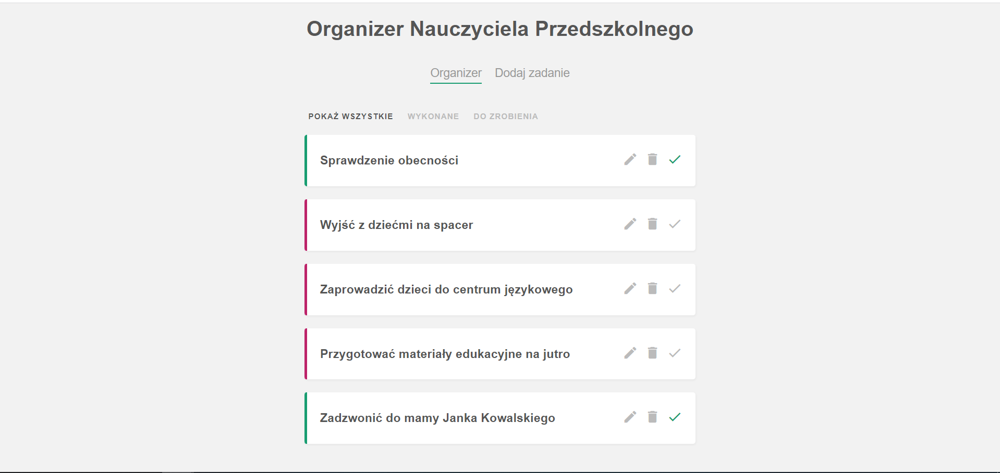
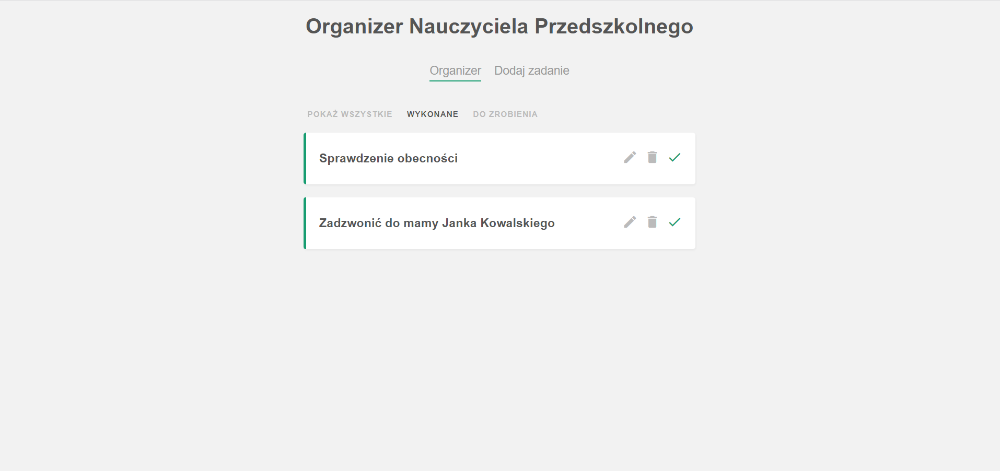
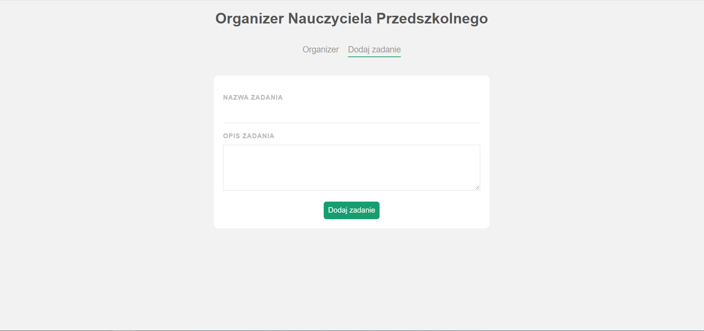

# Kindergarten APP
Jest to organizer dla nauczyciela przedszkolnego - pomaga on w planowaniu zadań.

## Preview
Na ten moment aby zobaczyć aplikację konieczne jest zaciągnięcie kodu z GitHuba i uruchomienie jej u siebie.
Podpunkt niżej znajduje się instrukcja jak to zrobić.

Zdjęcia poglądowe:

Głowny widok na aplikację. Kliknięcie nazwy zadania rozwija je umożliwiając przeczytanie dokładniejszego opisu.
Obok każdego z zadań znajdują się 3 ikony:
- edytuj zadanie (można zmienić tytuł oraz opis zadania)
- usuń zadanie
- zaznacz wykonanie zadania (lub odznacz)


Możliwe jest sortowanie zadań: pokaż wszystkie, pokaż tylko zadania wykonane (z zielonym borderem), pokaż tylko zadania niewykonane (z czerwonym borderem).


Po przejściu z zakładki 'Organizer' do zakładki 'Dodaj zadanie' dostępny jest formularz pozwalający dodawać nowe zadania do organizera.



## Jak uruchomić projekt u siebie

Przed rozpoczęciem wykonywania poniższej instrukcji konieczna jest globalna instalacja node oraz vue na komputrze.

1. Otwórz VS Code, sklonuj to repozytorium poprzez wpisanie w cmd:
```
git clone https://github.com/Yurghan/Kindergarten-APP.git
```

2. Następnie otwórz projekt w VS i zaistaluj wszystkie dependencies wpisując w cmd: 
```
npm install
```

3. Uruchom działanie bazy danych
```
json-server --watch data/db.json
```
jeśli nie działa to spróbuj tego:
```
npx json-server --watch data/db.json
```

4. Otwórz kolejną zakładkę cmd i uruchom serwer 
```
npm run serve
```

5. Gotowe !
Ctrl + LPM na lokalny link, który pojawił się w cmd pozwala na korzystanie z aplikacji.
